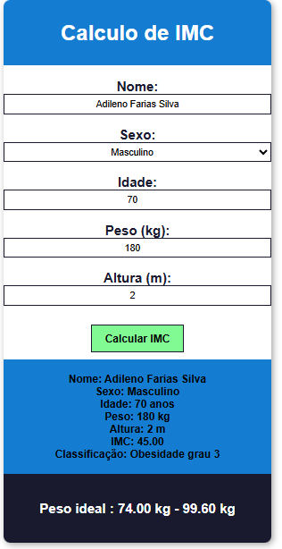

# 🩺 Calculadora de IMC — Health Tech

Aplicação web para cálculo do Índice de Massa Corporal (IMC), desenvolvida com foco em usabilidade para profissionais de saúde como nutricionistas, endocrinologistas e nutrólogos.

## 📸 Screenshot

## ✅ Funcionalidades

- Coleta de dados do paciente (nome, sexo, idade, peso e altura)
- Cálculo do IMC com classificação completa baseada na tabela da OMS
- Exibição do peso ideal para a altura informada
- Validação de todos os campos com mensagens de erro

## 🏷️ Classificação utilizada

| IMC | Classificação |
|-----|--------------|
| Abaixo de 18.5 | Abaixo do peso |
| 18.5 a 24.9 | Peso normal |
| 25.0 a 29.9 | Sobrepeso |
| 30.0 a 34.9 | Obesidade grau 1 |
| 35.0 a 39.9 | Obesidade grau 2 |
| Acima de 40 | Obesidade grau 3 |

## 🛠️ Tecnologias

- HTML5
- CSS3
- JavaScript
- Google Fonts (Poppins)

## 🔗 Acesse o projeto

[https://maxwellgeek.github.io/healthtech-imc](https://maxwellgeek.github.io/healthtech-imc)

## 📁 Como rodar localmente

1. Clone o repositório
   
   git clone https://github.com/maxwellgeek/healthtech-imc.git

2. Abra o arquivo `index.html` no navegador

## 👨‍💻 Autor

Maxwell — [GitHub](https://github.com/maxwellgeek)
